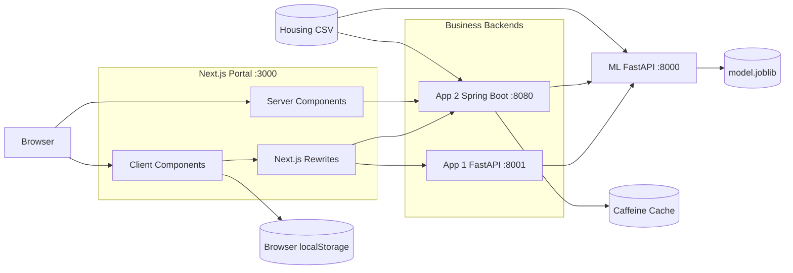
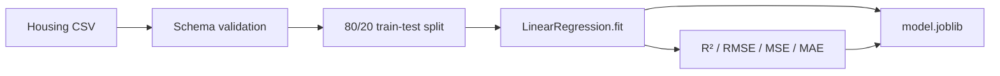

# Housing Price Prediction Fullstack System TRD

- **文档类型**：Technical Requirement Document
- **目标平台**：Web / Fullstack
- **需求来源**：[Interview Tasks Fullstack PRD](../docs/Interview%20Tasks%20Fullstack%20PRD.md)
- **开发人**：adam-wrote-this
- **版本**：V1.0
- **状态**：Draft
- **最后更新**：2026-08-15

## 1. 文档概述

### 1.1 目的

本文档将房价预测全栈面试 PRD 转换为可实施、可测试、可通过 Docker 复现的技术方案，覆盖：

1. Task 1 房价回归模型 API。
2. Task 2 统一 Next.js 多应用门户。
3. Python 与 Java 两个异构业务后端。
4. 跨服务接口、数据模型、缓存、错误处理、容器化和测试验收。

本文档描述**完整目标态**，并单独标注当前仓库实现与目标态之间的差距。未实现能力不得因出现在本文档中而被视为已经交付。

### 1.2 范围

- ML 推理服务：Python 3.12+、FastAPI、Scikit-learn。
- App 1：房产价值估算器，Python FastAPI 后端。
- App 2：房产市场分析，Java 21 + Spring Boot 3.4.4 后端。
- 统一门户：Next.js App Router、React Server Components、Tailwind CSS。
- Docker Compose 一键构建、启动和现场演示。

### 1.3 非目标

- 不引入用户账号、登录、权限和多租户体系。
- 不引入数据库；房产估算历史为当前浏览器设备级数据。
- 不引入 Redis、Kafka、独立 API Gateway 或独立 BFF 服务。
- 不进行模型调参、模型选择或线上持续训练。
- 不设计 Kubernetes、云基础设施或生产级弹性扩缩容。

### 1.4 核心原则

1. 浏览器不得直接调用 ML 服务。
2. 所有服务地址由环境变量提供，禁止硬编码宿主 IP。
3. Server Component 与 Client Component 按职责分离。
4. 输入校验在浏览器、业务后端和 ML 服务三层执行。
5. 错误必须结构化、可观测、可恢复。
6. 发布镜像不得依赖宿主源码 bind mount。

## 2. PRD 需求与当前实现差距

| 需求域 | 当前状态 | 目标状态 |
|---|---|---|
| ML 单条/批量预测 | 已实现 | 加固范围校验、readiness 和统一错误协议 |
| ML 模型信息与指标 | 已实现 | 保持系数、截距、R²、RMSE、MSE、MAE |
| App 1 七字段表单 | 已实现基础表单 | 增加字段级范围校验与可访问错误提示 |
| App 1 结果表格与图表 | 仅金额文本 | 增加结构化表格和估值图表 |
| App 1 历史记录 | 缺失 | 浏览器 `localStorage` 保存最近 20 条 |
| App 1 多房产对比 | 缺失 | 支持选择 2–4 条历史估值并排比较 |
| App 2 市场可视化 | 仅静态三行表格 | 增加分布图和统计卡片 |
| App 2 筛选 | 缺失 | Java 服务端统一筛选，前端同步查询条件 |
| App 2 排序/过滤表格 | 缺失 | 服务端分页/排序，前端响应式表格 |
| App 2 CSV/PDF 导出 | 缺失 | Java 根据完整筛选条件生成文件 |
| Java 数据集聚合 | 使用硬编码样例 | 从真实 housing CSV 加载不可变数据集 |
| Java 缓存 | 缺失 | Spring Cache + Caffeine，TTL 5 分钟 |
| RSC 首屏加载 | 页面均为 Client Component | 市场首屏由 Server Component 获取 |
| Route loading/error | 缺失 | 增加 `loading.tsx` 与 `error.tsx` |
| 自动化测试 | 仅 ML 手工 API 脚本 | pytest、JUnit、Vitest、Playwright、Smoke |
| 前端发布镜像 | `next dev` + bind mount | 多阶段生产镜像 + `next start`/standalone |

## 3. 系统总体架构

### 3.1 服务拓扑



### 3.2 强制调用链

```text
Property Estimator:
Browser → Next.js → Python Backend → ML Service

Market Query / Filter / Export:
Browser or Next.js RSC → Next.js → Java Backend → Housing CSV / Caffeine

Market What-if:
Browser → Next.js → Java Backend → ML Service
```

浏览器不得绕过 Next.js 直接调用 Java、Python 或 `ml-service:8000`。只有 What-if 需要 Java 调用 ML；市场查询、筛选、统计和导出只读取 Java 管理的 CSV 数据与缓存。Python 和 Java 后端负责业务校验、协议适配、超时和上游错误转换。

### 3.3 Docker 服务

| 服务 | Compose 名称 | 容器端口 | 宿主端口 | 依赖 |
|---|---|---:|---:|---|
| Next.js Portal | `frontend` | 3000 | 3000 | Python、Java |
| ML Service | `ml-service` | 8000 | 8000 | 模型与数据集 |
| Python Backend | `app1-python` | 8001 | 8001 | ML Service |
| Java Backend | `app2-java` | 8080 | 8080 | ML Service、数据集 |

## 4. 领域数据模型

### 4.1 HousingFeatures

七个服务间共享的房屋特征：

| 字段 | 类型 | 目标范围 | JSON 命名 |
|---|---|---|---|
| squareFootage | number | `> 0`，建议 `<= 100000` | Python/ML：`square_footage`；Java/Web：`squareFootage` |
| bedrooms | number | `>= 0`，建议整数，`<= 100` | `bedrooms` |
| bathrooms | number | `>= 0`，允许 0.5 步长，`<= 100` | `bathrooms` |
| yearBuilt | number | `1800..当前年份`，整数 | Python/ML：`year_built`；Java/Web：`yearBuilt` |
| lotSize | number | `> 0`，建议 `<= 10000000` | Python/ML：`lot_size`；Java/Web：`lotSize` |
| distanceToCityCenter | number | `>= 0`，建议 `<= 1000` | Python/ML：`distance_to_city_center`；Java/Web：`distanceToCityCenter` |
| schoolRating | number | `1..10` | Python/ML：`school_rating`；Java/Web：`schoolRating` |

所有数值必须是有限数字，禁止 NaN 和 Infinity。

### 4.2 PropertyRecord

```typescript
interface PropertyRecord extends HousingFeatures {
  id: string;
  price: number;
}
```

- `id` 由 Java 加载数据集时按稳定行号生成，例如 `property-0001`。
- `price` 为数据集真实价格，只用于市场统计和展示，不作为 What-if 输入。

### 4.3 EstimateHistoryItem

```typescript
interface EstimateHistoryItem {
  id: string;
  createdAt: string;
  features: HousingFeatures;
  predictedPrice: number;
  schemaVersion: 1;
}
```

约束：

- 存储 key：`housing-estimate-history:v1`。
- 最多保留最近 20 条，超限删除最旧记录。
- 历史仅属于当前浏览器，不承诺账号同步或跨设备同步。
- 解析失败或 schema 版本不兼容时丢弃无效记录，不阻塞页面。

### 4.4 MarketFilter

```typescript
interface MarketFilter {
  minPrice?: number;
  maxPrice?: number;
  minSquareFootage?: number;
  maxSquareFootage?: number;
  bedrooms?: number;
  minYearBuilt?: number;
  maxDistanceToCityCenter?: number;
  minSchoolRating?: number;
  sortBy?: "price" | "squareFootage" | "yearBuilt" | "schoolRating";
  sortDirection?: "asc" | "desc";
  page?: number;
  pageSize?: 10 | 20 | 50;
}
```

排序字段必须使用白名单，禁止把客户端字段直接拼接为动态表达式。

### 4.5 统一错误模型

```json
{
  "status": "error",
  "code": "VALIDATION_ERROR",
  "message": "One or more fields are invalid",
  "details": {
    "schoolRating": "must be between 1 and 10"
  },
  "traceId": "generated-request-id"
}
```

| HTTP 状态 | 场景 |
|---:|---|
| 400 | JSON 格式错误或不支持的查询参数 |
| 404 | 资源不存在 |
| 422 | 字段存在但校验失败 |
| 503 | ML 服务不可用、超时或模型未就绪 |
| 500 | 未预期内部错误 |

### 4.6 错误协议迁移策略

当前三套错误结构必须按以下顺序迁移，禁止一次性切换导致前端失去错误信息：

| 当前来源 | 当前结构 | 目标适配 |
|---|---|---|
| FastAPI 参数校验 | `detail: array` | `RequestValidationError` handler 转为 422 + `details` 字段映射 |
| FastAPI HTTPException | `detail: string/array` | 统一异常 handler 转为目标错误模型 |
| Java 参数缺失 | 400 + `{status,message}` | Bean Validation + `@RestControllerAdvice` 转为 422 + `details` |
| Java 运行异常 | 503 + `{status,message}` | Advice 补充 `code/details/traceId` |
| Next.js 当前解析 | `detail || message` | 依次解析目标模型、legacy detail string、legacy detail array、legacy message、HTTP fallback |

迁移阶段：

1. **消费者兼容**：先升级 Next.js HTTP 层和 Python/Java ML client，同时接受新旧结构；400 和 422 都归类为 ValidationError。
2. **生产者统一**：增加 FastAPI `RequestValidationError`/`HTTPException` handler 和 Spring `@RestControllerAdvice`，统一输出目标模型；traceId 从请求头透传或生成。
3. **移除兼容**：所有服务、契约测试和 Playwright 测试稳定一个版本后，删除 legacy `detail/message` 专用分支；状态码固定为语法错误 400、字段校验 422。

兼容期内响应必须始终保留可读 `message`，不得只返回机器 code。

## 5. Task 1：ML 推理服务设计

### 5.1 模块职责

- `train.py`：读取 CSV、切分训练/测试集、训练 LinearRegression、计算指标并持久化。
- `schemas.py`：输入输出模型和范围校验。
- `utils.py`：模型加载、特征顺序、有限数校验。
- `main.py`：FastAPI 生命周期、接口、错误映射和日志。

### 5.2 训练流程



要求：

- 固定 `random_state`，保证可复现。
- `model.joblib` 同时保存模型、特征顺序和指标。
- Docker 构建阶段自动执行训练。
- 模型加载失败时服务可启动用于诊断，但 readiness 返回 503。

### 5.3 API 设计

#### GET `/health`

模型就绪：

```json
{
  "status": "ok",
  "model_loaded": true,
  "version": "1.0.0",
  "timestamp": "2026-08-15T00:00:00Z"
}
```

- 模型就绪返回 HTTP 200。
- 模型未加载返回 HTTP 503，防止 Compose 错误标记 healthy。

#### POST `/predict`

单条请求：

```json
{
  "square_footage": 1850,
  "bedrooms": 3,
  "bathrooms": 2,
  "year_built": 1998,
  "lot_size": 7500,
  "distance_to_city_center": 5.6,
  "school_rating": 8.2
}
```

批量请求为上述对象数组，最大批量建议限制为 100 条。

响应：

单条请求固定返回 scalar：

```json
{
  "predictions": 315000.25,
  "status": "success",
  "message": "Single prediction completed"
}
```

批量请求固定返回与输入等长的 array：

```json
{
  "predictions": [315000.25, 402100.5],
  "status": "success",
  "message": "Batch prediction completed for 2 items"
}
```

该协议保持当前实现兼容：单条为 scalar，批量为 array。Python 和 Java ML client 必须根据请求形态校验响应形态，并在各自业务层归一化为强类型 DTO；禁止在 ML 服务中切换为 camelCase 或无版本改变联合类型。

#### GET `/model-info`

返回：

- `coefficients`。
- `intercept`。
- `feature_names`。
- `metrics.r2_score/mse/rmse/mae`。

本版本保持现有 snake_case 协议，不新增 `featureNames` 等重复字段。若未来需要 `trained_at` 和训练数据行数，应通过版本化 schema 增加可选字段，不能影响现有消费者。

## 6. App 1：Property Value Estimator

### 6.1 Python 后端

#### POST `/property/predict`

- 接收单条房屋特征。
- 执行范围校验和 snake_case 协议转换。
- 调用 ML `/predict`。
- connect timeout 2 秒，read timeout 10 秒。
- 返回 `predictedPrice`、`status`、`message`、`traceId`。

#### POST `/property/predict/batch`

- 接收 2–100 条房屋特征。
- 单次调用 ML 批量预测，禁止前端循环触发 N 次请求。
- 响应顺序必须与请求顺序一致。
- 用于多房产新建估算和批量比较扩展。

#### HTTP Client 生命周期

- 使用 FastAPI lifespan 创建并复用一个 `httpx.AsyncClient`。
- 应用关闭时显式 `aclose()`。
- 禁止每个请求创建新的连接池。

### 6.2 前端组件设计

```text
property-form/
├── page.tsx                    # Server Component 页面壳
├── loading.tsx                 # 路由加载态
├── error.tsx                   # 路由错误恢复
├── PropertyEstimatorClient.tsx # Feature 状态协调
├── PropertyForm.tsx            # 七字段表单与校验
├── PredictionTable.tsx         # 当前结果表格
├── PredictionChart.tsx         # 估值图表
├── HistoryPanel.tsx            # 最近 20 条历史
└── ComparisonView.tsx          # 2–4 条并排对比
```

### 6.3 表单与校验

采用 React Hook Form + Zod：

- `mode: "onBlur"`，提交时全量校验。
- 每个字段显示就近错误信息。
- 错误容器使用 `aria-describedby` 和 `aria-invalid`。
- 提交期间禁用按钮，防止重复请求。
- 成功后保存历史，失败不写历史。

### 6.4 结果展示

- 表格展示七个输入特征和预测价格。
- Recharts 柱状图展示当前预测与所选历史预测价格。
- 图表必须提供等价文本/表格，不把图形作为唯一信息来源。
- 金额统一使用 `Intl.NumberFormat`，币种从配置读取，默认 USD。

### 6.5 历史与对比

- `useEstimateHistory` 封装读取、添加、删除、清空和 schema 迁移。
- 默认按时间倒序展示。
- 支持选择 2–4 条记录进入对比。
- 比较维度：七个特征、预测价格、创建时间。
- 对比视图在移动端横向滚动，桌面端并排展示。

## 7. App 2：Property Market Analysis

### 7.1 Java 数据加载

- 将原始 housing CSV 复制到 `backend-java/src/main/resources/data/housing.csv`。
- 启动时解析为不可变 `List<PropertyRecord>`。
- 校验字段数量、数值有效性、价格和特征范围。
- 任一行损坏时启动失败并输出行号，不使用静默跳过。
- 硬编码 `SAMPLE_DATA` 仅可保留在测试 fixture，不得作为运行数据源。

### 7.2 Java 模块拆分

```text
com.property/
├── controller/
│   ├── MarketController.java
│   └── ExportController.java
├── service/
│   ├── MarketQueryService.java
│   ├── MarketAggregationService.java
│   ├── WhatIfService.java
│   └── MarketExportService.java
├── repository/
│   └── CsvPropertyRepository.java
├── dto/
├── model/
├── config/
│   ├── CacheConfig.java
│   └── RestClientConfig.java
└── exception/
    └── GlobalExceptionHandler.java
```

### 7.3 市场接口

#### GET `/market/segments`

接受 MarketFilter 中除分页外的筛选条件，返回：

```json
[
  {
    "segment": "Under $200k",
    "count": 6,
    "avgPrice": 152166.67,
    "minPrice": 125000,
    "maxPrice": 185000,
    "avgSquareFootage": 1016.67
  }
]
```

所有统计必须基于筛选后的真实数据集。

#### GET `/market/properties`

响应：

```json
{
  "items": [],
  "page": 1,
  "pageSize": 20,
  "total": 0,
  "totalPages": 0
}
```

- 筛选、排序、分页均在 Java 后端执行。
- page 从 1 开始。
- 超出最后一页返回空 items，不返回 500。

#### POST `/market/whatif`

- 接收七个特征和可选 `baselineSquareFootage`。
- 有 baseline 时调用 ML 两次，返回 predicted/baseline/difference。
- 无 baseline 时只调用一次，baseline 和 difference 为 null。
- What-if 不缓存，避免动态输入污染缓存空间。

#### GET `/market/export.csv`

#### GET `/market/export.pdf`

- 接收与 `/market/properties` 相同筛选和排序条件，不接收分页。
- 导出完整筛选结果，不只导出当前页。
- 设置 `Content-Disposition: attachment`。
- 文件名包含 UTC 时间戳。
- CSV 使用 UTF-8 BOM，确保常用表格软件正确打开。
- PDF 使用 OpenPDF，包含筛选摘要、生成时间和数据表格。
- 导出数量上限 10,000 条；超限返回 422。

### 7.4 缓存设计

采用 Spring Cache + Caffeine：

| 缓存 | Key | TTL | 最大条目 | 适用接口 |
|---|---|---:|---:|---|
| `marketSegments` | 标准化筛选条件 hash | 5 分钟 | 500 | `/market/segments` |
| `marketProperties` | 筛选+排序+分页 hash | 5 分钟 | 500 | `/market/properties` |

- 数据集在进程生命周期内只读，无需主动失效。
- What-if、health 和导出不缓存。
- 缓存 key 必须对 null、默认值和查询参数顺序做标准化。
- 暴露命中率日志，不在响应中暴露内部 key。

### 7.5 前端组件设计

```text
market-analysis/
├── page.tsx                 # RSC 首屏加载
├── loading.tsx
├── error.tsx
├── MarketDashboardClient.tsx
├── MarketFilters.tsx
├── MarketSummaryCards.tsx
├── MarketCharts.tsx
├── PropertyTable.tsx
├── WhatIfPanel.tsx
└── ExportActions.tsx
```

### 7.6 RSC 与客户端数据流

- `page.tsx` 为 Server Component。
- 在请求时直接通过 `JAVA_BACKEND_URL` 获取首屏 segments 和第一页 properties。
- 页面使用 `export const dynamic = "force-dynamic"`，避免镜像构建时依赖 Java 服务在线。
- 初始数据以可序列化 props 传给 Client Component。
- 客户端筛选变化后通过 `/api/java/**` rewrite 请求。
- 请求使用 AbortController，下一次筛选发起时取消上一次请求。
- 文本筛选防抖 300ms；select、checkbox 和显式提交立即请求。

### 7.7 可视化与表格

- Summary Cards：总量、平均价、平均面积、平均学校评级。
- 图表：价格区间分布、平均价格与平均面积。
- 表格支持列排序、筛选摘要、分页和 loading skeleton。
- `aria-sort` 标记当前排序状态。
- 移动端表格允许横向滚动，关键列保持可见。

## 8. Next.js 门户架构

### 8.1 Server/Client 边界

| 能力 | Component 类型 |
|---|---|
| 根 layout、metadata、页面壳 | Server Component |
| 市场首屏数据加载 | Server Component |
| 表单、历史、对比、筛选、排序 | Client Component |
| Recharts 图表 | Client Component，使用 dynamic import |
| API rewrite | Next.js server runtime |

禁止仅因读取 locale 就把整个 `page.tsx` 标记为 `"use client"`。客户端文案区域应通过窄 Client Component 或服务端 locale 输入解决。

### 8.2 状态分层

- 全局状态：locale 和跨页面导航 UI。
- 路由状态：`loading.tsx`、`error.tsx`。
- Feature 状态：表单、筛选、排序、分页、What-if、历史选择。
- 请求状态：各 feature 独立 pending/error，禁止一个全局 boolean 表示所有并发请求。
- 不引入 Redux；使用 Context + custom hooks 即可满足当前规模。

### 8.3 请求层

```text
lib/api/
├── browserHttp.ts      # 浏览器同源请求、AbortSignal、ApiError
├── serverHttp.ts       # server-only 绝对地址请求
├── pythonApi.ts
├── javaApi.ts
└── javaServerApi.ts
```

- 浏览器调用 `/api/python/**` 和 `/api/java/**`。
- Server Component 调用容器内绝对 URL。
- GET 不默认发送 `Content-Type`。
- JSON body 请求设置 `application/json`。
- 默认 timeout：查询 10 秒、导出 30 秒。
- 解析非 JSON 错误时保留 HTTP status fallback。

### 8.4 设计系统

共享组件：

- Button、Input、Select、Checkbox、Card。
- Table、Pagination、Skeleton、Alert、Dialog。
- FieldError、EmptyState、VisuallyHidden。

要求：

- 颜色和间距由 Tailwind theme token 管理。
- 可交互区域最小 44×44 px。
- 可见焦点指示器不得移除。
- loading 使用 `aria-busy`；动态结果使用 `aria-live="polite"`。
- 图标按钮必须有可访问名称。
- 动画遵循 `prefers-reduced-motion`。

### 8.5 页面过渡与视觉一致性

- 路由切换使用 `loading.tsx` 骨架屏保持页面框架稳定，禁止整页空白闪烁。
- 筛选、图表和结果面板仅对 opacity/transform 使用 150–200ms CSS transition，不对布局尺寸做长动画。
- `prefers-reduced-motion: reduce` 时关闭非必要过渡。
- 两个应用共用颜色、字体、间距、圆角、阴影和交互状态 token；禁止各页面自定义一套视觉变量。
- 页面标题、表单密度、统计卡片和表格层级遵循同一设计规范。

验收标准：路由切换无白屏；数据更新不引起不可控布局跳动；两应用的同类 Button/Input/Card/Table 在视觉和交互状态上保持一致；375px、768px、1440px 均无重叠。

## 9. 错误处理与可观测性

### 9.1 Trace ID

- Next.js 为请求生成/透传 `x-trace-id`。
- Python 和 Java 继续透传给 ML。
- 所有错误响应和日志包含 traceId。
- 日志不得记录完整用户输入中的未来敏感扩展字段。

### 9.2 错误边界

- `app/error.tsx`：门户级不可恢复错误。
- 业务路由 `error.tsx`：RSC 首屏请求失败，可点击重试。
- Client mutation：局部错误提示，不触发整页 ErrorBoundary。
- 上游 ML 不可用：业务后端返回 503，前端保留已加载内容。

### 9.3 日志

结构化日志最少字段：

```text
service, timestamp, level, traceId, method, path, status, durationMs, errorCode
```

不记录预测模型对象、完整 stack trace 到用户响应或导出文件。

## 10. 安全与输入防御

- 所有外部输入执行类型、范围和有限数校验。
- 导出格式使用固定路由，禁止客户端提供文件系统路径。
- 排序字段使用枚举白名单。
- CSV 单元格以 `=`, `+`, `-`, `@` 开头时进行公式注入转义。
- PDF/CSV 文件名由服务端生成。
- 不使用 `dangerouslySetInnerHTML` 渲染用户输入。
- 请求体和批量条数设上限，防止内存滥用。
- 容器以非 root 用户运行。

## 11. Docker 与配置设计

### 11.1 发布镜像

| 服务 | 构建要求 |
|---|---|
| ML | Python 3.12 slim；安装依赖；构建时训练；非 root 运行 |
| Python | Python 3.12 slim；`pip install --no-cache-dir`；非 root 运行 |
| Java | Maven + JDK 21 构建阶段；JRE 21 运行阶段；非 root 运行 |
| Frontend | Node 20 多阶段；`npm ci`、`next build`、standalone 运行 |

### 11.2 Compose

- 发布 Compose 不挂载源码、node_modules 或 `.next`。
- `depends_on.condition: service_healthy` 控制后端启动顺序。
- ML health 必须反映模型 readiness。
- Frontend 增加 healthcheck。
- 所有地址通过环境变量注入。

### 11.3 环境变量

| 服务 | 变量 | 示例 |
|---|---|---|
| Python | `ML_SERVICE_URL` | `http://ml-service:8000` |
| Java | `ML_SERVICE_URL` | `http://ml-service:8000` |
| Frontend | `PYTHON_BACKEND_URL` | `http://app1-python:8001` |
| Frontend | `JAVA_BACKEND_URL` | `http://app2-java:8080` |
| Java | `CACHE_TTL_SECONDS` | `300` |
| Java | `CACHE_MAX_SIZE` | `500` |

## 12. 测试与验收

详细测试策略见 [TEST_PLAN](../docs/TEST_PLAN.md)。

### 12.1 自动化层级

- ML/Python：pytest + FastAPI TestClient。
- Java：JUnit 5 + MockMvc + MockRestServiceServer。
- Frontend：Vitest + Testing Library。
- E2E：Playwright Chromium。
- 全链路：Docker Compose Smoke。

### 12.2 核心验收

1. 四服务可从干净环境一键构建并启动。
2. ML 单条/批量预测、model-info、health 通过。
3. Python 和 Java 通过容器 DNS 调用 ML。
4. App 1 字段校验、表格、图表、历史和 2–4 条对比通过。
5. App 2 首屏 RSC、筛选、排序、分页、图表、What-if、CSV/PDF 导出通过。
6. 缓存命中、TTL 和标准化 key 验证通过。
7. ML 下线时两后端返回 503，恢复后无需重启业务后端。
8. 375px、768px、1440px 布局通过。
9. 键盘流程、label、aria-live、aria-sort 和焦点指示器通过。
10. 两条 Playwright 主旅程连续 3 次通过，无 console error。

## 13. 分阶段实施计划

### Phase 1：契约与基础可靠性

- 统一 HousingFeatures 范围和错误协议。
- 加固 ML readiness、Python client 和 Java timeout。
- Java 加载真实 CSV。
- 补基础单元与契约测试。

**退出标准**：三服务接口契约一致，非法范围返回 422，ML 下线返回 503。

### Phase 2：App 1 完整能力

- 字段级校验。
- 结果表格与图表。
- 历史记录和 schema 迁移。
- 2–4 条并排比较。
- Python 批量预测接口。

**退出标准**：App 1 PRD 五项前端能力全部可演示。

### Phase 3：App 2 数据与服务能力

- Repository、真实数据聚合。
- 筛选、排序、分页。
- CSV/PDF 导出。
- Caffeine 缓存。
- Java 单元/集成测试。

**退出标准**：筛选统计一致，导出内容匹配筛选结果，缓存行为可验证。

### Phase 4：Next.js 架构与 UX

- 恢复 Server/Client 边界。
- 市场 RSC 首屏。
- route loading/error。
- Custom hooks、请求取消和局部状态。
- WCAG 与响应式走查。

**退出标准**：首屏无客户端二次重复请求，主流程无 hydration 错误。

### Phase 5：交付与演示

- 生产 Dockerfile 和发布 Compose。
- Vitest、Playwright、Smoke。
- README、Swagger 和演示脚本。
- 全链路冷启动验收。

**退出标准**：仅安装 Docker 即可完成完整现场演示。

## 14. 风险与回滚

| 风险 | 影响 | 缓解与回滚 |
|---|---|---|
| RSC 构建期访问后端 | 前端镜像构建失败 | `force-dynamic`，仅运行时请求；保留客户端加载作为短期回滚 |
| localStorage schema 变化 | 历史页面崩溃 | 版本化 key、容错解析、可清空历史 |
| PDF 生成内存开销 | 导出导致 OOM | 10,000 条上限、流式响应、压测；必要时仅保留 CSV |
| 缓存 key 不一致 | 命中率低或错误复用 | 标准化 filter DTO、缓存 key 单测；可通过配置关闭缓存 |
| Java 切换真实 CSV | 统计结果变化 | 固定 fixture 和快照测试；保留旧数据仅用于测试对照 |
| 统一错误协议迁移 | 前端兼容问题 | HTTP 层同时兼容 `detail` 和 `message` 一个版本 |
| 发布 Compose 改造 | 开发热更新受影响 | 单独保留 `compose.dev.yml`，发布配置不 bind mount |

## 15. PRD 追踪矩阵

| ID | PRD 原始要求 | TRD 落点 | 可执行验收 |
|---|---|---|---|
| T1-01 | 基于数据集构建、容器化、部署回归模型 | 5.1、5.2、11.1 | 冷构建镜像并完成预测 |
| T1-02 | predict 支持单条输入 | 5.3 | 单条 API E2E，响应为 scalar |
| T1-03 | predict 支持批量输入 | 5.3 | 2–100 条批量 E2E，响应等长 |
| T1-04 | model-info 返回系数和性能指标 | 5.3 | Swagger/API 断言字段和 7 个系数 |
| T1-05 | health 健康检查 | 5.3 | 模型就绪 200、未就绪 503 |
| T1-06 | Python 3.12+ | 5.1、11.1 | 镜像运行时版本断言 |
| T1-07 | FastAPI | 5.1 | OpenAPI schema 与服务启动测试 |
| T1-08 | Scikit-learn | 5.2 | 训练产物类型与预测测试 |
| T1-09 | GitHub 源代码 | 13 Phase 5 | 仓库交付清单 |
| T1-10 | Dockerfile | 11.1 | 独立 `docker build` 通过 |
| T1-11 | Swagger/OpenAPI 现场演示 | 5.3、16 | `/docs` 可访问并执行三接口 |
| PORTAL-01 | 共享布局与应用间导航 | 8.1、8.4 | Playwright 导航与布局断言 |
| PORTAL-02 | App Router 应用内/应用间路由 | 8.1 | 路由构建和直接刷新测试 |
| PORTAL-03 | 两应用一致设计系统 | 8.4、8.5 | 组件视觉 token 与状态快照 |
| PORTAL-04 | Layout 层 loading/error | 8.2、9.2 | 路由 loading 与故障重试 E2E |
| A1-FE-01 | 全字段房产表单 | 6.2、6.3 | 七字段组件/E2E 测试 |
| A1-FE-02 | 客户端校验与错误提示 | 6.3 | 边界值、aria-invalid、字段错误测试 |
| A1-FE-03 | 结果表格和图表 | 6.4 | DOM、图表和等价文本断言 |
| A1-FE-04 | 历史记录 | 4.3、6.5 | 刷新后最近 20 条保留 |
| A1-FE-05 | 多房产并排对比 | 6.5 | 选择 2–4 条并排比较 E2E |
| A1-BE-01 | 处理表单提交 | 6.1 | Python handler 集成测试 |
| A1-BE-02 | 集成 Task 1 模型容器 | 3.2、6.1 | Docker DNS 真实链路测试 |
| A1-BE-03 | 数据校验与错误处理 | 4.1、4.5、4.6、6.1 | 422/503 契约测试 |
| A2-FE-01 | 交互式市场可视化仪表盘 | 7.5、7.7 | Playwright 图表与统计卡片断言 |
| A2-FE-02 | 房产细分筛选 | 4.4、7.3、7.6 | 筛选前后 API/UI 数据一致 |
| A2-FE-03 | What-if 模型分析 | 7.3、7.5 | predicted/baseline/difference E2E |
| A2-FE-04 | CSV/PDF 导出 | 7.3 | 文件名、类型、行数、筛选条件测试 |
| A2-FE-05 | 响应式排序/过滤表格 | 7.3、7.7 | 排序分页 API + 375/768/1440px E2E |
| A2-BE-01 | 市场分析 REST API | 7.2、7.3 | MockMvc 与 API E2E |
| A2-BE-02 | 从数据集生成聚合统计 | 7.1、7.3 | 固定 CSV 统计断言 |
| A2-BE-03 | 集成 Task 1 模型容器 | 3.2、7.3 | What-if Docker 真实链路 |
| A2-BE-04 | 缓存性能优化 | 7.4 | 命中、TTL、key 标准化测试 |
| NEXT-01 | 使用 App Router | 8.1 | `next build` 和路由清单 |
| NEXT-02 | 合理使用 Server/Client Components | 8.1 | client boundary 静态检查 |
| NEXT-03 | RSC 初始数据加载 | 7.6、8.1 | 首屏有数据且无客户端重复 GET |
| NEXT-04 | 合理数据获取策略 | 7.6、8.3 | server/client 请求路径、取消和 timeout 测试 |
| NEXT-05 | 共享功能 Custom Hooks | 6.5、7.6、8.2 | History/Market/What-if Hook 单测 |
| UI-01 | Tailwind 响应式布局 | 8.4、8.5 | 375/768/1440px 截图与溢出检查 |
| UI-02 | WCAG 无障碍组件 | 8.4 | axe、键盘、label、ARIA 测试 |
| UI-03 | Loading 与 Error Boundary | 8.2、9.2 | 慢请求和异常恢复 E2E |
| UI-04 | 页面和状态平滑过渡 | 8.5 | 无白屏/布局跳动，reduced-motion 测试 |
| UI-05 | 统一现代视觉设计 | 8.4、8.5 | 两应用共享 token 和组件状态审查 |
| STATE-01 | 合理客户端状态管理 | 8.2 | 状态作用域与并发请求测试 |
| STATE-02 | 表单状态与校验 | 6.3 | 表单组件和错误恢复测试 |
| STATE-03 | 高效数据获取模式 | 7.4、7.6、8.3 | RSC、缓存、防抖、取消测试 |
| STATE-04 | API 通信和错误状态 | 4.5、4.6、8.3、9.2 | 新旧协议兼容与故障 E2E |
| CODE-01 | Next.js 最佳实践代码组织 | 6.2、7.2、8.1、8.3 | 目录、依赖方向和 lint 审查 |
| TECH-01 | Python 3.12+ / FastAPI | 5.1、6.1、11.1 | 两 Python 镜像版本与启动测试 |
| TECH-02 | Java 21 | 7.2、11.1 | 构建与运行时版本断言 |
| TECH-03 | Spring Boot 3.4.4 | 7.2 | Maven effective-pom 与启动测试 |
| DEL-01 | GitHub 源代码 | 13 Phase 5 | 交付清单和干净 clone 验证 |
| DEL-02 | 面试现场演示 | 16 | 完整演示脚本逐项通过 |

## 16. 现场演示流程

1. 执行 `docker compose up --build`。
2. 打开 ML Swagger，演示 health、单条/批量 predict、model-info。
3. 打开门户，演示 App 1 校验、预测、图表、历史和对比。
4. 演示 App 2 首屏统计、筛选、排序、What-if 和 CSV/PDF 导出。
5. 切换移动端 viewport 与中文界面。
6. 停止 ML 服务，演示 503 错误和页面恢复。
7. 重启 ML，验证业务后端无需重启即可恢复。

## 17. 开放问题

以下问题在实施前需要产品/面试方确认；未确认时采用本文默认值：

1. 货币是否固定 USD？默认 USD。
2. 历史是否需要跨设备？默认仅浏览器本地。
3. 导出最大条数是否可接受 10,000？默认接受。
4. PDF 是否必须服务端生成？默认由 Java 服务端生成。
5. 市场数据是否允许复制一份到 Java resources？默认允许，来源仍为附件数据集。
