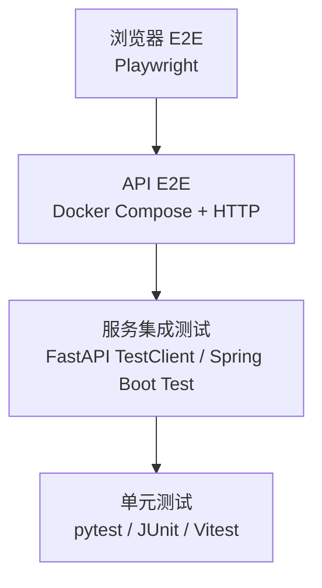

# Housing ML Fullstack 测试计划

## 1. 文档信息

| 项目 | 内容 |
|---|---|
| 测试对象 | Housing ML Fullstack 全栈房价预测系统 |
| 覆盖版本 | 当前工作区 `main` 分支 |
| 测试类型 | 单元、服务集成、API E2E、浏览器 E2E、容器 Smoke、异常恢复 |
| 主运行环境 | macOS + Docker Desktop + Docker Compose |
| 计划状态 | 待执行 |
| 测试数据 | `docs/Test Data For Prediction.csv` 与固定边界数据 |

## 2. 测试目标

1. 验证四个服务可通过 `docker compose up --build` 一键构建和启动。
2. 验证 ML 服务的单条预测、批量预测、模型信息和输入校验。
3. 验证 Python、Java 后端通过 Docker 服务名调用 ML 服务。
4. 验证 Next.js rewrites 正确代理 Python 和 Java 请求。
5. 验证房源预测和市场分析两条浏览器主链路。
6. 验证依赖服务不可用、非法输入和前端运行缓存冲突时系统可观测、可恢复。
7. 建立可重复执行的自动化回归入口和明确的发布门禁。

## 3. 测试范围

### 3.1 范围内

- `ml-service`
  - 模型构建和加载。
  - `GET /health`。
  - `POST /predict` 单条与批量预测。
  - `GET /model-info`。
- `backend-python`
  - `GET /health`。
  - `POST /property/predict`。
  - ML 服务异常转换为 HTTP 503。
- `backend-java`
  - `GET /health`。
  - `GET /market/segments`。
  - `POST /market/whatif`。
  - 必填字段校验、baseline 计算和 ML 服务异常处理。
- `nextjs-portal`
  - 三个页面路由。
  - 表单输入、加载态、错误态和结果展示。
  - 中英文切换。
  - `/api/python/**`、`/api/java/**` rewrites。
  - 响应式布局，最低宽度 375px。
- Docker Compose
  - 构建、启动顺序、健康检查、服务发现、日志和清理。

### 3.2 范围外

- 线性回归算法调参和模型优劣评选。
- 大规模压力、容量和长稳测试。
- 真实云环境、Kubernetes 和生产域名。
- 多用户并发数据隔离；当前系统无数据库和用户体系。
- 浏览器矩阵全覆盖；首轮只验证 Chromium，发布前补 Safari 手工冒烟。

## 4. 质量风险

| 风险 | 影响 | 优先级 | 对应测试 |
|---|---|---:|---|
| 模型未生成或容器启动后未加载 | 所有预测不可用 | P0 | ML-SMOKE-01、ML-INT-01 |
| Python/Java 使用 `localhost` 调 ML | 容器内调用失败 | P0 | PY-E2E-01、JAVA-E2E-02 |
| Next rewrite 路径或前缀错误 | 前端接口 404/502 | P0 | WEB-API-01~03 |
| 全局 loading/error 状态竞争 | 页面遮罩或错误提示异常 | P1 | WEB-COMP-02、WEB-E2E-04 |
| 市场分段请求重复触发 | Java QPS 异常 | P1 | WEB-E2E-03 |
| ML 停止后后端崩溃 | 服务不可恢复 | P0 | PY-RES-01、JAVA-RES-01 |
| 输入只校验类型、不校验业务范围 | 产生无意义价格 | P1 | CONTRACT-NEG-01~03 |
| 宿主 build 覆盖容器 `.next` | Client Manifest 500 | P1 | OPS-RES-01 |
| 金额/字段命名跨端不一致 | UI 空值或格式错误 | P1 | CONTRACT-01~03 |

## 5. 测试策略

### 5.1 应用类型

混合全栈应用：两个 FastAPI/Spring REST 后端、一个 ML REST 服务和一个 React/Next.js 浏览器前端。

### 5.2 分层模型



  | 层级 | 目标 | 工具 | 执行频率 |
  |---|---|---|---|
  | 单元 | 纯函数、校验、统计和错误解析 | pytest、JUnit 5、Vitest | 每次修改 |
  | 服务集成 | Controller/handler 到 service/client 边界 | FastAPI TestClient、Spring Boot Test/MockMvc | 每次 PR |
  | API E2E | 真实容器网络和真实模型 | Docker Compose + HTTP 脚本 | 每次 PR、发布前 |
  | 浏览器 E2E | 用户可见页面和完整代理链 | Playwright Chromium | 每次 PR、发布前 |
  | 容器 Smoke | 构建、健康、启动顺序、清理 | Docker Compose | 每次 PR、发布前 |

  ### 5.3 主验证栈

  当前已验证：

- Docker daemon：可用。
- Node.js：`v22.21.1`。
- npm：`10.9.4`。
- 宿主 Maven：不可用，但 Java 可使用 Maven 构建镜像执行测试。

| 能力 | 当前状态 | 计划目标 |
|---|---|---|
| 基础设施 | Docker Compose 四服务可用 | 保持真实四服务验证 |
| ML API 测试 | `ml-service/test_api.py` 脚本 | pytest 单元测试 + 运行中服务 E2E |
| Python 测试 | 未配置 | pytest + FastAPI TestClient + httpx MockTransport |
| Java 测试 | 已有 `spring-boot-starter-test`，无测试类；镜像使用 `-DskipTests` | JUnit 5 + Spring Boot Test + MockMvc + `MockRestServiceServer`，构建执行测试 |
| 前端测试 | 只有 `dev/build/start/lint` 脚本 | Vitest + Testing Library + `test` 脚本 |
| 浏览器 E2E | 未配置 | Playwright Chromium + `test:e2e` 脚本 |
| API/Smoke | 可手工 curl | `scripts/smoke-test.sh`，输出 JUnit/Markdown 证据 |

### 5.4 回退矩阵

| 不可用能力 | 回退方式 | 保留能力 | 已知缺口 |
|---|---|---|---|
| Docker 不可用 | Python/Node 服务本地启动，后端 ML client 使用 mock；Java 需宿主 JDK 21 + Maven 3.9 | Playwright、Python/Node 单元和服务集成测试 | 无法验证容器 DNS、healthcheck 和启动顺序；若宿主仍无 Maven，Java 运行与集成测试必须跳过并阻断完整 PASS |
| Node.js 不可用 | 使用 API E2E 覆盖后端链路 | Docker Compose 和服务集成测试 | 无法验证真实浏览器渲染、路由和交互 |
| Playwright 浏览器安装失败 | Chromium 手工验收 + API E2E | Docker 与 Node 单测 | 无自动截图、DOM 和浏览器行为证据 |
| 宿主 Maven 不可用 | Maven Docker 构建阶段执行 `mvn test` | Java 全部测试能力 | 本地 IDE 外命令反馈较慢 |

任何回退必须记录失败命令、原始错误、覆盖损失和批准人。

## 6. 测试环境

### 6.1 端口与服务

| 服务 | Compose 名称 | 宿主端口 | 容器内依赖 |
|---|---|---:|---|
| Next.js | `frontend` | 3000 | `app1-python:8001`、`app2-java:8080` |
| ML | `ml-service` | 8000 | `model.joblib` |
| Python | `app1-python` | 8001 | `ml-service:8000` |
| Java | `app2-java` | 8080 | `ml-service:8000` |

### 6.2 环境准备

```bash
docker info
docker compose version
node --version
npm --version
```

完整重建前清理：

```bash
docker compose down --volumes --remove-orphans
docker compose up --build -d
```

等待标准：

- `ml-service`、`app1-python`、`app2-java` 状态为 `healthy`。
- `frontend` 状态为 `Up`。
- 最长等待时间 180 秒，超时即失败并保留日志。

## 7. 测试数据策略

### 7.1 标准数据

使用 `docs/Test Data For Prediction.csv` 的 10 条样例。第一条作为默认单条预测数据：

```json
{
  "square_footage": 1550,
  "bedrooms": 3,
  "bathrooms": 2,
  "year_built": 1997,
  "lot_size": 6800,
  "distance_to_city_center": 4.1,
  "school_rating": 7.6
}
```

### 7.2 边界数据

- 缺少任一必填字段。
- 字段类型为字符串、数组或 null。
- 空批量数组。
- 单条和 10 条批量输入。
- 有/无 `baselineSquareFootage` 的 What-if。
- 负面积、未来年份、`school_rating < 1` 或 `> 10`。

### 7.3 隔离和清理

系统无持久化写入，测试请求天然独立：

- 不依赖执行顺序。
- 不依赖预存数据库状态。
- 每个测试重新构造 payload。
- 容器测试结束执行 `docker compose down --volumes --remove-orphans`。

预测结果不使用硬编码绝对价格作为主要断言，避免模型重新训练产生小幅浮点变化。应断言有限数字、响应结构、批量长度和可重复性；同一模型和输入重复预测的差异应小于 `0.01`。

## 8. 关键用户旅程

| ID | 用户旅程 | 通过标准 |
|---|---|---|
| J-01 | 首页进入房源预测，提交默认数据 | 展示格式化美元价格，无错误提示 |
| J-02 | 首页进入市场分析 | 显示 `Under $200k`、`$200k - $350k`、`Over $350k` 三个分段，各 `count=6` |
| J-03 | 调整面积并执行 What-if | 展示 predicted、baseline 和 difference，三者为有限数字 |
| J-04 | 切换中文后完成两个业务流程 | 导航、表单和结果标签切换中文，功能不受影响 |
| J-05 | ML 服务不可用时提交房源预测 | Python 返回 503 JSON，房源页面显示错误且不白屏 |
| J-06 | ML 服务不可用时执行市场 What-if | Java 返回 503 JSON，市场页面显示错误且不白屏 |

## 9. 详细测试用例

### 9.1 ML 服务

| ID | 优先级 | 场景 | 输入/步骤 | 预期结果 | 自动化层级 |
|---|---:|---|---|---|---|
| ML-UNIT-01 | P0 | 特征顺序 | 打乱 JSON 字段顺序 | 按 `feature_names` 正确组装 | 单元 |
| ML-UNIT-02 | P1 | 模型加载失败 | 模型文件不存在/损坏 | 记录错误，服务可启动，health 为 error | 单元 |
| ML-SMOKE-01 | P0 | 健康检查 | `GET /health` | 200，`status=ok`，`model_loaded=true` | API E2E |
| ML-API-01 | P0 | 单条预测 | 合法 7 字段对象 | 200，`predictions` 为有限 number | API E2E |
| ML-API-02 | P0 | 批量预测 | 10 条 CSV 数据 | 200，数组长度 10，均为有限 number | API E2E |
| ML-API-03 | P1 | 空批量 | `[]` | 422，错误 JSON | API E2E |
| ML-API-04 | P1 | 缺少字段 | 删除 `school_rating` | 422，服务不崩溃 | API E2E |
| ML-API-05 | P1 | 错误类型 | `bedrooms=[]` | 422 | API E2E |
| ML-API-06 | P1 | 模型信息 | `GET /model-info` | 200；7 个 feature、7 个 coefficient；metrics 含 R²/RMSE/MSE/MAE | API E2E |
| ML-API-07 | P1 | 确定性 | 相同输入连续调用 3 次 | 最大价格差 `< 0.01` | API E2E |

### 9.2 Python 业务后端

| ID | 优先级 | 场景 | 输入/步骤 | 预期结果 | 自动化层级 |
|---|---:|---|---|---|---|
| PY-INT-01 | P0 | Health handler | TestClient 调 `/health` | 200，service=`app1-python` | 服务集成 |
| PY-INT-02 | P0 | ML client 成功 | mock ML 返回价格 | 返回 `predicted_price`、success | 服务集成 |
| PY-INT-03 | P0 | ML client 超时/连接失败 | mock 抛 `MLServiceError` | 503，detail 含 unavailable | 服务集成 |
| PY-API-01 | P0 | 真实预测链路 | 合法 payload 请求 8001 | 200，价格为有限数字 | API E2E |
| PY-API-02 | P1 | 缺字段 | 删除任一字段 | 422 | API E2E |
| PY-E2E-01 | P0 | 容器服务发现 | 容器内请求 ML | 请求成功，日志目标为 `ml-service:8000` | API E2E |
| PY-RES-01 | P0 | ML 下线 | 停止 `ml-service` 后请求 | 503 JSON，Python 容器保持 Up | 恢复测试 |
| PY-RES-02 | P1 | ML 恢复 | 重启 ML，等待 healthy 后重试 | 无需重启 Python 即恢复 200 | 恢复测试 |

### 9.3 Java 市场后端

| ID | 优先级 | 场景 | 输入/步骤 | 预期结果 | 自动化层级 |
|---|---:|---|---|---|---|
| JAVA-UNIT-01 | P0 | 市场分段统计 | 调 `getMarketSegments()` | 3 段，每段 count=6，价格区间不交叉 | 单元 |
| JAVA-INT-01 | P0 | Health | MockMvc `GET /health` | 200，service=`backend-java` | 服务集成 |
| JAVA-INT-02 | P0 | What-if 无 baseline | mock 一次 ML 预测 | 200，baseline/difference 为 null | 服务集成 |
| JAVA-INT-03 | P0 | What-if 有 baseline | mock 两次 ML 预测 | difference=`predicted-baseline` | 服务集成 |
| JAVA-INT-04 | P1 | 缺少必填字段 | 缺 `schoolRating` | 400，错误 JSON | 服务集成 |
| JAVA-INT-05 | P0 | ML 异常 | mock client 抛 RuntimeException | 503，错误 JSON | 服务集成 |
| JAVA-API-01 | P0 | 市场分段接口 | `GET /market/segments` | 200，3 个分段，各 6 条 | API E2E |
| JAVA-E2E-02 | P0 | 真实 What-if | 合法 payload + baseline | 200，三项价格关系正确 | API E2E |
| JAVA-RES-01 | P0 | ML 下线 | 停止 ML 后 What-if | 503 JSON，Java 容器保持 Up | 恢复测试 |
| JAVA-RES-02 | P1 | ML 恢复 | 重启 ML 后重试 | 无需重启 Java 即恢复 200 | 恢复测试 |

### 9.4 Next.js API 与组件

| ID | 优先级 | 场景 | 输入/步骤 | 预期结果 | 自动化层级 |
|---|---:|---|---|---|---|
| WEB-UNIT-01 | P0 | `requestJson` 成功 | mock 200 JSON | 返回泛型数据 | 单元 |
| WEB-UNIT-02 | P0 | JSON 错误 | mock 503 `{message}`/`{detail}` | 抛 `ApiError`，保留 status/message | 单元 |
| WEB-UNIT-03 | P1 | 非 JSON 错误 | mock 502 text | 抛 fallback `Request failed with 502` | 单元 |
| WEB-COMP-01 | P0 | 房源表单提交 | mock Python API | loading 出现后消失，展示价格 | 组件 |
| WEB-COMP-02 | P1 | 请求失败 | mock API reject | loading 复位，显示错误，可再次提交 | 组件 |
| WEB-COMP-03 | P0 | 市场首次加载 | mock segments | skeleton 消失，3 行数据出现 | 组件 |
| WEB-COMP-04 | P0 | What-if | mock Java API | 展示 predicted/baseline/difference | 组件 |
| WEB-COMP-05 | P1 | 语言切换 | 点击语言按钮 | 文案和 `<html lang>` 更新 | 组件 |
| WEB-API-01 | P0 | Python rewrite | POST `/api/python/property/predict` | 200，结构与 8001 一致 | API E2E |
| WEB-API-02 | P0 | Java GET rewrite | GET `/api/java/market/segments` | 200，结构与 8080 一致 | API E2E |
| WEB-API-03 | P0 | Java POST rewrite | POST `/api/java/market/whatif` | 200，payload/response 未被修改 | API E2E |

### 9.5 浏览器 E2E

| ID | 优先级 | 场景 | 步骤 | 预期结果 |
|---|---:|---|---|---|
| WEB-E2E-01 | P0 | 首页导航 | 打开首页，进入两个业务页并返回 | URL 和页面标题正确，无 console error |
| WEB-E2E-02 | P0 | 房源预测 | 使用默认值提交 | loading 可见，结束后出现美元价格 |
| WEB-E2E-03 | P0 | 市场分析 | 打开页面并监控 `/api/java/market/segments` | 页面稳定后请求次数为 1，表格有 3 行 |
| WEB-E2E-04 | P0 | What-if | 修改面积，提交仿真 | 显示三项价格，页面无白屏 |
| WEB-E2E-05 | P1 | 中文流程 | 切中文并完成预测 | 用户可见标签为中文，结果正常 |
| WEB-E2E-06 | P1 | 移动端 | viewport 375×812 跑两个页面 | 无水平溢出，表单和按钮可操作 |
| WEB-E2E-07 | P0 | 后端故障 | 停止目标后端后发请求 | 显示错误提示，ErrorBoundary 不替换整页 |
| WEB-E2E-08 | P1 | 刷新/路由切换 | 两页面间切换并刷新 5 次 | 无 React Client Manifest、hydration 或重复 key 错误 |

### 9.6 契约与业务范围负向测试

以下用例定义的是目标业务约束。当前 Pydantic/Java DTO 主要校验存在性和类型，预计部分用例会失败；失败必须登记缺陷，不能修改预期迎合现状。

| ID | 优先级 | 输入 | 目标预期 | 当前风险 |
|---|---:|---|---|---|
| CONTRACT-NEG-01 | P1 | `square_footage=-1` | 400/422 | 当前可能接受并预测 |
| CONTRACT-NEG-02 | P1 | `year_built` 大于当前年份 | 400/422 | 当前可能接受 |
| CONTRACT-NEG-03 | P1 | `school_rating=0` 或 11 | 400/422 | 当前可能接受 |
| CONTRACT-NEG-04 | P1 | NaN/Infinity 字符串 | 400/422 | 防止非有限数字进入模型 |
| CONTRACT-01 | P0 | Python snake_case payload | 前端、Python、ML 字段完全一致 | 重命名会静默破坏链路 |
| CONTRACT-02 | P0 | Java camelCase payload | 前端与 Java DTO 字段一致 | 大小写错误导致 null/400 |
| CONTRACT-03 | P0 | Java 响应价格字段 | `predictedPrice` 等前端可读 | 命名不一致导致 UI 空值 |

### 9.7 Docker 与恢复

| ID | 优先级 | 场景 | 操作 | 预期结果 |
|---|---:|---|---|---|
| OPS-SMOKE-01 | P0 | 冷构建 | 清理后 `docker compose up --build -d` | 180 秒内服务可用 |
| OPS-SMOKE-02 | P0 | 健康状态 | `docker compose ps` | 三后端 healthy，前端 Up |
| OPS-SMOKE-03 | P0 | 网络地址 | 检查环境和日志 | 服务间不使用 localhost |
| OPS-SMOKE-04 | P1 | 清理 | `docker compose down --volumes --remove-orphans` | 无项目容器和孤儿网络残留 |
| OPS-RES-01 | P1 | Client Manifest 恢复 | 开发容器运行时触发冲突，再 restart frontend | restart 后 `/market-analysis` 返回 200 |
| OPS-RES-02 | P1 | 容器重启 | 分别重启四服务 | 服务恢复且主链路仍通过 |

## 10. 非功能测试

### 10.1 性能冒烟

不设正式容量 SLA，只做单用户性能回归门槛：

| 指标 | 门槛 | 测量方式 |
|---|---:|---|
| 后端 health | P95 < 500 ms | 连续 20 次 HTTP 请求 |
| 单条 ML 预测 | P95 < 2 s | 预热后连续 20 次 |
| 市场分段 | P95 < 1 s | 连续 20 次 |
| What-if | P95 < 3 s | 连续 20 次 |
| 首页首个可见内容 | < 3 s | Playwright trace，开发机冷启动除外 |

性能门槛只用于发现数量级退化，不作为跨机器精确 benchmark。

### 10.2 可访问性与响应式

- 所有 input 有可关联 label。
- 按钮可通过 Tab 聚焦并由 Enter/Space 触发。
- 错误提示和 loading 状态可被辅助技术感知。
- 375px、768px、1440px 无内容重叠和不可操作控件。
- 键盘完成房源预测主流程。

### 10.3 安全冒烟

- 前端请求 URL 不暴露 token、个人信息或密钥。
- 非法 JSON 和超大字段返回 4xx，不返回堆栈。
- 后端错误响应不泄露容器文件路径。
- 外部输入不会直接插入 `dangerouslySetInnerHTML`。

## 11. 自动化落地顺序

1. 将现有 `ml-service/test_api.py` 改造成可被 pytest 收集的测试，并保留运行中服务 E2E 套件；增加测试依赖和 Docker `test` stage。
2. 为 `backend-python` 增加 TestClient 和 ML client mock 测试，并增加 Docker `test` stage。
3. 为 `backend-java` 增加 MarketService 单测和 MockMvc Controller 测试；增加 Docker `test` stage，禁止该 stage 使用 `-DskipTests`。
4. 为前端增加 Vitest、Testing Library、`test` 脚本和 HTTP/组件测试，并增加 Docker `test` stage。
5. 增加 Playwright 配置和两个主业务流程。
6. 增加根级 `scripts/test-all.sh` 和 `scripts/smoke-test.sh`：`test-all.sh` 依次构建四个模块的 Docker `test` target，报告通过/失败/跳过数并在任一失败时非零退出；`smoke-test.sh` 统一执行健康、API、rewrite 和清理验证。
7. 在 CI 中固定执行顺序：静态检查 → 单元/集成 → Compose smoke → Playwright。

当前可执行基线：

```bash
docker compose config --quiet
docker compose up --build -d
curl --fail http://localhost:8000/health
curl --fail http://localhost:8001/health
curl --fail http://localhost:8080/health
curl --fail http://localhost:3000/
docker compose down --volumes --remove-orphans
```

完成上述自动化落地步骤 1~6 后，统一命令为：

```bash
# 各模块单测/集成测试
./scripts/test-all.sh

# 应用镜像构建
docker compose build

# 全链路
docker compose up --build -d
./scripts/smoke-test.sh
npm --prefix nextjs-portal run test:e2e
docker compose down --volumes --remove-orphans
```

## 12. 执行批次

### Batch A：P0 构建与 API 基线

- OPS-SMOKE-01~03。
- ML-SMOKE-01、ML-API-01~02、ML-API-06。
- PY-API-01、PY-E2E-01。
- JAVA-API-01、JAVA-E2E-02。
- WEB-API-01~03。

失败条件：任一服务不能构建/启动、健康检查失败或核心 API 非 2xx。

### Batch B：服务级回归与异常

- 全部单元和服务集成用例。
- ML-API-03~07。
- PY-RES-01~02。
- JAVA-RES-01~02。
- 契约负向用例。

失败条件：P0 用例失败；P1 目标约束失败可登记已知缺陷，但必须有负责人和处置结论。

### Batch C：浏览器与发布验收

- WEB-E2E-01~08。
- 响应式、可访问性和性能冒烟。
- OPS-SMOKE-04、OPS-RES-01~02。

失败条件：主流程不可完成、页面白屏、重复请求、代理失败或控制台出现未处理异常。

## 13. 进入与退出标准

### 13.1 进入标准

- 需求和接口路径已冻结。
- 完整验收默认要求 Docker daemon 可用，Dockerfile、Compose 和构建上下文齐备，`docker compose config --quiet` 通过。
- Docker 不可用时，只有记录失败命令、覆盖损失并获得批准后，才可进入回退测试；该次执行只能给出 `PASS WITH CONDITIONS` 或 `FAIL`，不能给出完整 `PASS`。
- 测试数据文件可读且原件不修改。
- 所有已知环境变量有记录。
- 测试期间端口 3000/8000/8001/8080 可用。

### 13.2 退出标准

- P0 用例通过率 100%。
- P1 用例通过率不低于 95%，其余均有已确认缺陷和负责人。
- 两条浏览器主链路连续执行 3 次通过。
- 四服务冷构建和全链路 Smoke 通过。
- 无未关闭的崩溃、白屏、数据结构不兼容或服务恢复失败。
- 测试报告包含命令、时间、环境、通过/失败/跳过数和失败日志。

## 14. 缺陷分级

| 级别 | 定义 | 示例 |
|---|---|---|
| P0 | 阻断交付，核心流程不可用 | 服务无法启动、预测接口 500、页面白屏 |
| P1 | 主要功能错误，有有限绕过方式 | 重复请求、错误态无法恢复、输入范围未校验 |
| P2 | 次要体验或兼容问题 | 文案、样式、非主浏览器差异 |
| P3 | 建议优化 | 日志可读性、测试效率改进 |

## 15. 测试证据与报告模板

每次完整执行保存：

- `docker compose ps` 输出。
- 四服务构建与启动日志。
- 单元/集成测试 JUnit XML 或控制台摘要。
- API Smoke 请求状态和关键响应字段。
- Playwright HTML report、trace、失败截图和视频。
- 环境版本：Git commit、Docker、Node、浏览器。

最终报告至少包含：

```text
执行时间：
Git commit：
测试环境：
测试批次：A / B / C
总用例：
通过：
失败：
跳过：
P0 未关闭：
P1 未关闭：
回退能力与已知缺口：
结论：PASS / PASS WITH CONDITIONS / FAIL
```

## 16. 评审检查清单

- [ ] 每个核心接口至少有成功、非法输入和依赖失败用例。
- [ ] Python/Java 的 ML client 可在不启动真实 ML 时独立测试。
- [ ] 浏览器 E2E 经过 Next rewrites，而不是绕过 Next 直连后端。
- [ ] Docker 和 Playwright 能力分别验证，未因一个不可用而跳过另一个。
- [ ] 预测断言避免依赖脆弱的绝对浮点值。
- [ ] 所有 fallback 都记录覆盖损失。
- [ ] P0 失败会阻断交付，不允许仅写入已知问题。
- [ ] 测试结束后容器、网络和测试产物可追踪且环境可清理。
