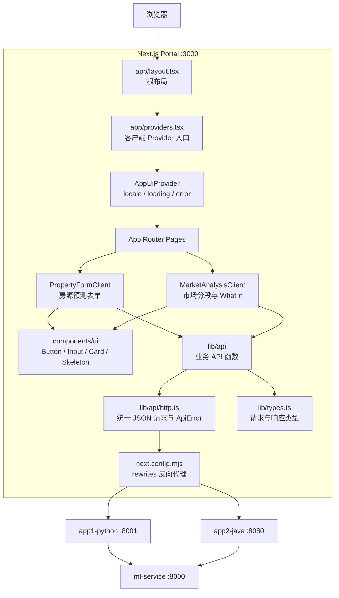
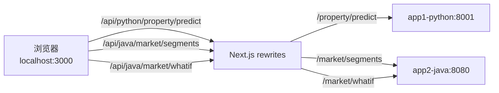
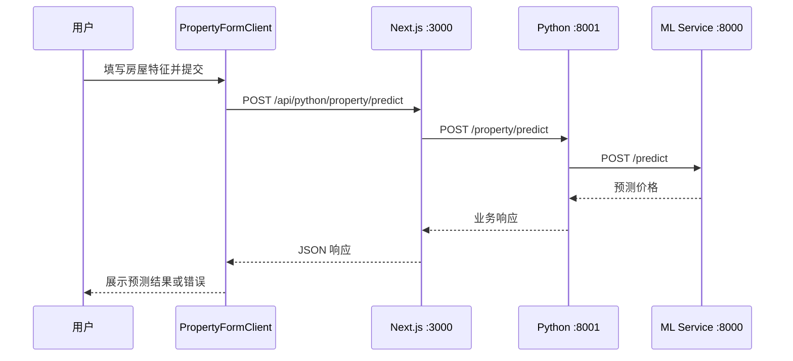
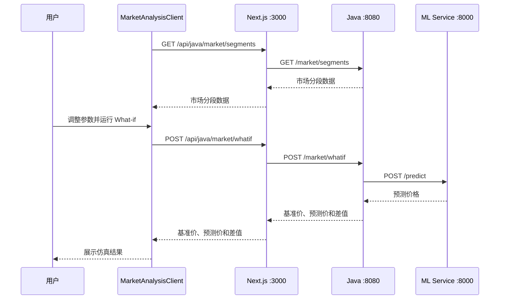

# Next.js Portal

Housing ML Fullstack 的统一前端门户，基于 Next.js 14 App Router、React 18、TypeScript 和 Tailwind CSS。
门户提供房源价格预测和市场分析两个业务入口。浏览器只访问 Next.js；Next.js 通过 rewrites 将请求代理到 Python 或 Java 后端，从而保持浏览器请求同源并避免跨域配置。

## 功能与页面
| 路由 | 功能 | 后端 |
|---|---|---|
| `/` | 首页导航 | 无 |
| `/property-form` | 录入房屋特征并预测价格 | Python FastAPI |
| `/market-analysis` | 查看市场分段并执行 What-if 仿真 | Java Spring Boot |

全局能力包括：
- 中英文切换。
- 全局 loading 和错误提示。
- React Error Boundary 渲染兜底。
- 响应式布局和基础表单组件。

## 前端项目架构


### 分层职责
| 层级 | 位置 | 职责 |
|---|---|---|
| 路由与页面 | `app/` | App Router 路由、页面布局和业务组件组装 |
| 全局应用组件 | `components/` | Provider、导航、语言切换、全局 loading/error 和错误边界 |
| 基础 UI | `components/ui/` | 无业务语义的按钮、输入框、卡片和骨架屏 |
| API 调用 | `lib/api/` | Python/Java API 函数和统一 HTTP 错误处理 |
| 类型契约 | `lib/types.ts` | 前后端请求与响应的 TypeScript 类型 |
| 国际化 | `lib/i18n.ts` | 中英文文案和 locale 类型 |
| 代理配置 | `next.config.mjs` | 将浏览器同源 API 路径转发到容器后端 |

## API 转发逻辑

浏览器不会直接请求 `localhost:8001` 或 `localhost:8080`。业务代码统一请求 Next.js 的 `/api/python/**` 或 `/api/java/**` 路径：


```text
浏览器请求：GET http://localhost:3000/api/java/market/segments
Next 转发： GET http://app2-java:8080/market/segments
```

`/api/java` 和 `/api/python` 只是 Next.js 用于选择目标后端的前缀，转发时不会保留。

### 为什么需要 rewrites

- 浏览器始终访问 `localhost:3000`，请求保持同源。
- 后端不需要为前端开发端口单独配置 CORS。
- 浏览器不需要知道 Docker 内部服务名和端口。
- 开发、Docker 和部署环境可通过环境变量切换后端地址。

rewrites 只做代理转发，不会修改业务请求体或响应结构，也不是 `app/api/**/route.ts` API Route。

## 业务数据流

### 房源价格预测



### 市场分析与 What-if



## 目录结构

```text
nextjs-portal/
├── app/
│   ├── layout.tsx                 # 根布局
│   ├── page.tsx                   # 首页
│   ├── providers.tsx              # 客户端 Provider 组合
│   ├── globals.css                # 全局样式
│   ├── property-form/
│   │   ├── page.tsx               # 房源预测路由
│   │   └── form-client.tsx        # 表单状态和提交逻辑
│   └── market-analysis/
│       ├── page.tsx               # 市场分析路由
│       └── analysis-client.tsx    # 分段加载和 What-if 逻辑
├── components/
│   ├── AppUiProvider.tsx          # locale、loading、error 状态
│   ├── ErrorBoundary.tsx          # 客户端渲染错误兜底
│   ├── GlobalErrorAlert.tsx       # 全局错误提示
│   ├── GlobalLoader.tsx           # 全局加载遮罩
│   ├── HeaderNav.tsx              # 顶部导航
│   ├── LanguageToggle.tsx         # 语言切换
│   └── ui/                        # 基础 UI 组件
├── lib/
│   ├── api/
│   │   ├── http.ts                # requestJson 和 ApiError
│   │   ├── pythonApi.ts           # Python 后端 API
│   │   └── javaApi.ts             # Java 后端 API
│   ├── i18n.ts                    # 中英文文案
│   └── types.ts                   # TypeScript 数据类型
├── next.config.mjs                # Next rewrites 配置
├── tailwind.config.ts             # Tailwind 配置
├── tsconfig.json                  # TypeScript 配置
├── Dockerfile                     # 前端开发镜像
└── package.json
```

## 环境变量

| 变量 | Docker Compose 值 | 宿主机直接运行建议值 |
|---|---|---|
| `PYTHON_BACKEND_URL` | `http://app1-python:8001` | `http://localhost:8001` |
| `JAVA_BACKEND_URL` | `http://app2-java:8080` | `http://localhost:8080` |

Docker 容器中的 `localhost` 指向容器自身，因此前端容器必须通过 Compose 服务名 `app1-python` 和 `app2-java` 访问后端。

## 运行方式

### Docker 一键启动（推荐）

在仓库根目录执行：

```bash
docker compose up --build
```

访问：

- 门户首页：http://localhost:3000
- 房源预测：http://localhost:3000/property-form
- 市场分析：http://localhost:3000/market-analysis

查看前端日志：

```bash
docker compose logs -f frontend
```

停止服务：

```bash
docker compose down
```

### 宿主机直接运行前端

先确保 Python 和 Java 后端已在宿主机端口启动，再执行：

```bash
cd nextjs-portal
npm install
PYTHON_BACKEND_URL=http://localhost:8001 \
JAVA_BACKEND_URL=http://localhost:8080 \
npm run dev
```

## 开发命令

```bash
npm run dev     # 启动开发服务器
npm run build   # 生产构建、类型检查和 lint
npm run start   # 启动已构建的生产服务
npm run lint    # Next.js ESLint
```

## 错误处理

所有业务 API 最终通过 `lib/api/http.ts` 的 `requestJson<T>()` 请求：

- 非 2xx 响应转换为 `ApiError`。
- JSON 错误响应优先读取 `detail` 或 `message`。
- 无法解析错误响应时保留 HTTP 状态 fallback。
- 页面业务组件捕获错误并写入全局错误提示。
- React 渲染异常由 `ErrorBoundary` 兜底，避免整页白屏。

## 常见问题

### 1. 浏览器请求为什么只看到 3000 端口

这是预期行为。浏览器请求 Next.js 同源路径，Next.js 在服务端内部代理到 Python 或 Java 后端。可在前端容器日志和后端日志中观察完整链路。

### 2. 宿主机运行前端时报 `app1-python` 或 `app2-java` 无法解析

这两个名称只存在于 Docker Compose 网络。宿主机运行时应显式设置：

```bash
PYTHON_BACKEND_URL=http://localhost:8001
JAVA_BACKEND_URL=http://localhost:8080
```

### 3. 出现 `Could not find the module ... in the React Client Manifest`

当前 Compose 会将整个 `nextjs-portal` 挂载到容器 `/app`，宿主机和容器会看到同一个 `.next` 目录。如果容器中的 `next dev` 正在运行，同时在宿主机执行 `npm run build`，生产构建可能覆盖开发模式的 Client Manifest。

恢复方式：

```bash
docker compose restart frontend
```

开发容器运行期间避免在宿主机执行 `npm run build`。如需生产构建验证，先停止前端开发容器，或在独立 Docker 构建环境中执行。

### 4. 前端接口返回 502 或请求失败

检查全部服务状态和健康接口：

```bash
docker compose ps
curl http://localhost:8000/health
curl http://localhost:8001/health
curl http://localhost:8080/health
```

再查看对应日志：

```bash
docker compose logs frontend app1-python app2-java ml-service
```

## 相关文件

- [Next.js 代理配置](next.config.mjs)
- [统一 HTTP 客户端](lib/api/http.ts)
- [Python API 封装](lib/api/pythonApi.ts)
- [Java API 封装](lib/api/javaApi.ts)
- [Docker Compose 配置](../docker-compose.yml)
- [项目总说明](../README.md)
